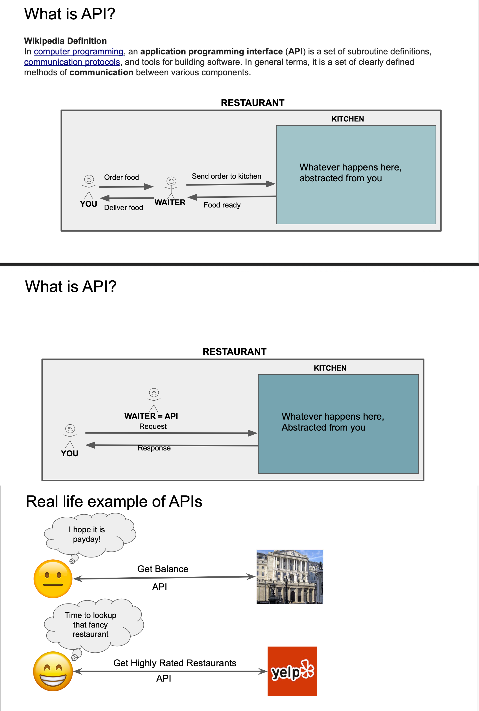

# Understanding API with Real World Example - Study Notes

## 🌐 What is API?

**API (Application Programming Interface)** - Interface that allows software applications to communicate with each other.

**Simple Analogy:** API is like a **waiter in restaurant**
- Client orders food → Waiter → Kitchen → Waiter → Client gets food

## 🔄 How APIs Work

**Basic Flow:** `Client Request → API → Server → API → Client Response`

**Real Example - Weather App:**
1. App requests: `GET /weather?city=NewYork`
2. Weather service processes request
3. Returns: `{"city": "New York", "temp": "25°C"}`
4. App displays: "New York: 25°C"

## 📱 Common API Examples

- **Social:** Facebook login, Twitter share buttons
- **Payment:** PayPal checkout, Stripe processing  
- **Maps:** Google Maps in Uber, location services
- **Communication:** Email APIs, SMS APIs

## 🔧 API Types

**Architecture:**
- **REST** - Most common, HTTP methods
- **GraphQL** - Single endpoint, flexible queries
- **SOAP** - XML-based, enterprise

**Access:**
- **Public** - Open (Twitter, GitHub)
- **Private** - Internal company use
- **Partner** - Business partners only

## ❓ Interview Q&A

**Q: What is an API?**  
A: Interface allowing software applications to communicate

**Q: Real-world API example?**  
A: Weather app getting temperature data from weather service

**Q: REST vs GraphQL?**  
A: REST uses multiple endpoints, GraphQL uses single endpoint

**Q: Why use APIs?**  
A: Faster development, integration, avoid reinventing functionality

**Q: API request components?**  
A: HTTP method, URL, headers, optional body

## 🎯 Key Points
✅ **API** = Software communication interface  
✅ **Examples** = Weather, payments, social login  
✅ **Types** = REST, GraphQL; Public, Private  
✅ **Benefits** = Integration, faster development  
✅ **Flow** = Request → Process → Response

---
💡 **Interview Tip:** "APIs enable software to talk to each other - like ordering food through a waiter"

## 📸 Screenshots

### API Explanation Diagram

