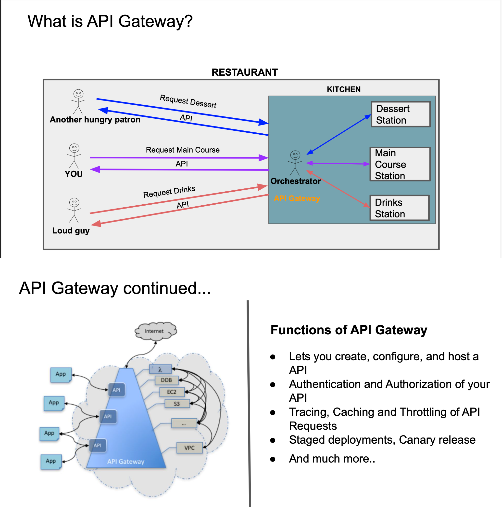
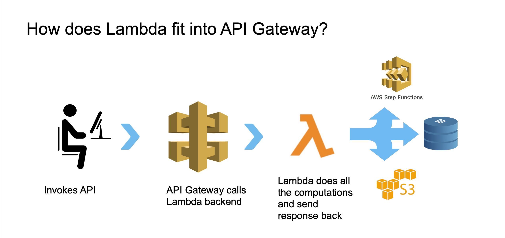

# What is AWS API Gateway - Study Notes

## 🌐 What is AWS API Gateway?

**AWS API Gateway** - Fully managed service that makes it easy to create, publish, maintain, monitor, and secure APIs at any scale.

**Simple Definition:** Acts as a **"front door"** for applications to access backend services.

## ⚙️ Functions of API Gateway

### **Core Functions:**
- **API Management** - Create, deploy, and manage REST and WebSocket APIs
- **Request/Response Handling** - Process incoming requests, format responses
- **Authentication & Authorization** - Secure API access with AWS IAM, Cognito
- **Rate Limiting** - Control API usage and prevent abuse
- **Monitoring & Logging** - CloudWatch integration for metrics and logs
- **Caching** - Improve performance with response caching
- **CORS Support** - Enable cross-origin resource sharing

### **Key Features:**
```yaml
✅ Serverless - No infrastructure to manage
✅ Auto-scaling - Handles any traffic volume
✅ Pay-per-use - Only pay for API calls
✅ Integration - Works with Lambda, EC2, HTTP endpoints
✅ Security - Built-in DDoS protection, WAF integration
```

## 🔗 How Lambda Fits into API Gateway

### **API Gateway + Lambda Integration:**

**Flow:** `Client → API Gateway → Lambda Function → Response`

### **Why This Combination?**
- **Serverless Architecture** - No servers to manage
- **Event-driven** - API calls trigger Lambda functions
- **Automatic scaling** - Both services scale automatically
- **Cost-effective** - Pay only for actual usage

### **Integration Types:**
1. **Lambda Proxy Integration** - API Gateway passes entire request to Lambda
2. **Lambda Custom Integration** - Transform request/response

### **Example Flow:**
```yaml
1. Client makes HTTP request:
   GET https://api.example.com/users/123
   
2. API Gateway receives request:
   - Validates request
   - Checks authentication
   - Routes to Lambda function
   
3. Lambda function processes:
   - Extracts user ID (123)
   - Queries database
   - Returns user data
   
4. API Gateway returns response:
   - Formats response
   - Adds CORS headers
   - Returns to client
```

## 🏗️ Common Use Cases

### **REST APIs:**
- **Mobile app backends**
- **Web application APIs**
- **Microservices architecture**

### **WebSocket APIs:**
- **Real-time chat applications**
- **Live notifications**
- **Gaming applications**

### **Integration Scenarios:**
- **Lambda functions** (serverless computing)
- **EC2 instances** (existing applications)
- **HTTP endpoints** (third-party services)
- **AWS services** (S3, DynamoDB, etc.)

## ❓ Interview Q&A

**Q: What is AWS API Gateway?**  
A: Fully managed service for creating, deploying, and managing APIs at scale

**Q: Main functions of API Gateway?**  
A: API management, security, monitoring, rate limiting, caching, CORS

**Q: How does Lambda integrate with API Gateway?**  
A: API Gateway triggers Lambda functions when API endpoints are called

**Q: Why use API Gateway with Lambda?**  
A: Creates serverless, auto-scaling, cost-effective API architecture

**Q: What's Lambda Proxy Integration?**  
A: API Gateway passes entire HTTP request to Lambda for processing

**Q: Benefits of API Gateway?**  
A: Serverless, auto-scaling, pay-per-use, built-in security features

## 🎯 Key Points

✅ **API Gateway** = Managed service for API creation and management  
✅ **Functions** = Security, monitoring, rate limiting, caching  
✅ **Lambda Integration** = Serverless API backend architecture  
✅ **Benefits** = Auto-scaling, pay-per-use, no infrastructure  
✅ **Use Cases** = Mobile backends, microservices, real-time apps

---
💡 **Interview Tip:** "API Gateway is the front door that securely routes API requests to Lambda functions, creating a fully serverless architecture"

## 📸 Screenshots

### API Gateway Overview


### Lambda & API Gateway Integration
