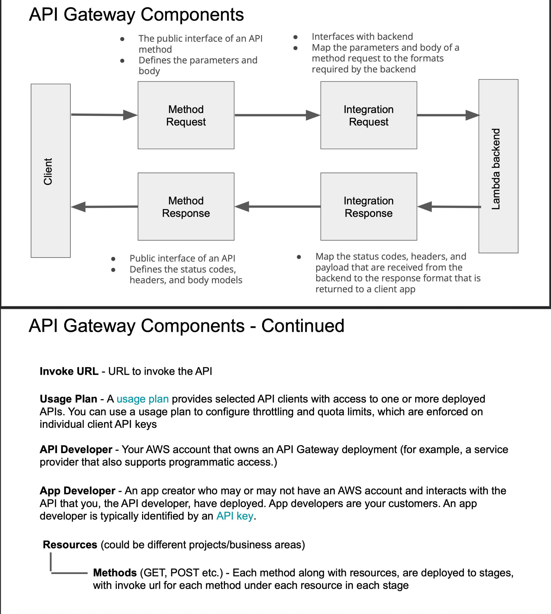

# API Gateway Components - Study Notes

## 🔧 11 Essential API Gateway Components

### **Complete Architecture Flow:**
```
Client → Invoke URL → Resources → Methods → Method Request → Integration Request
→ Lambda Backend → Integration Response → Method Response → Client
```

## 📋 All Components Overview

### 1️⃣ **Method Request**
First entry point that **validates incoming requests**
- **Authentication** - Check API keys, IAM roles
- **Authorization** - Verify permissions
- **Validation** - Check required parameters, headers
- **Request parsing** - Extract query parameters, headers, body

**Example:**
```yaml
Method Request validates:
  ✅ API key present
  ✅ Required header: Content-Type
  ✅ Query parameter: userId
  ✅ Request body format
```

### 2️⃣ **Integration Request**
**Transforms** client request for the backend service
- **Data transformation** - Modify request format
- **Parameter mapping** - Map query params to different names
- **Header manipulation** - Add/remove/modify headers
- **Body transformation** - Convert request body format

**Example:**
```yaml
Transform:
  Client sends: {"name": "John"}
  Backend gets: {"userName": "John", "timestamp": "2023-01-01"}
```

### 3️⃣ **Lambda Backend**
The **actual business logic** that processes the request
- **Core processing** - Handle business logic
- **Data operations** - Database queries, calculations
- **External integrations** - Call other services
- **Response generation** - Create response data

**Example:**
```python
def lambda_handler(event, context):
    user_id = event['userId']  # From Integration Request
    user_data = get_user_from_db(user_id)
    return {"statusCode": 200, "body": user_data}
```

### 4️⃣ **Integration Response**
**Transforms** backend response for the client
- **Response transformation** - Modify response format
- **Status code mapping** - Map backend codes to HTTP codes
- **Header manipulation** - Add CORS, security headers
- **Error handling** - Format error responses

**Example:**
```yaml
Transform:
  Lambda returns: {"statusCode": 200, "body": "data"}
  Client gets: HTTP 200 with proper headers and formatted body
```

### 5️⃣ **Method Response**
Final step that **sends response back to client**
- **Response validation** - Ensure proper format
- **Status code setting** - HTTP response codes
- **Header setting** - CORS, content-type headers
- **Final formatting** - Format response for client

**Example:**
```http
HTTP/1.1 200 OK
Content-Type: application/json
Access-Control-Allow-Origin: *

{"message": "Success", "data": {...}}
```

### 6️⃣ **Invoke URL**
**Unique endpoint** to call your API
- **API endpoint** - Public URL for API access
- **Regional/Edge optimized** - Different URL formats
- **Security** - HTTPS by default
- **Routing** - Direct requests to API Gateway

**Example:**
```
https://abc123.execute-api.us-east-1.amazonaws.com/prod/users
Format: https://{api-id}.execute-api.{region}.amazonaws.com/{stage}/{resource}
```

### 7️⃣ **Usage Plan**
**Controls API access** and usage limits. Provides selected API clients with access to one or more deployed APIs with throttling and quota limits enforced on individual client API keys
- **Rate limiting** - Requests per second/minute
- **Quota management** - Monthly/daily limits
- **Throttling** - Prevent API abuse
- **Billing control** - Cost management

**Example:**
```yaml
Usage Plan:
  - Rate: 1000 requests/second
  - Burst: 2000 requests
  - Quota: 1,000,000 requests/month
```

### 8️⃣ **API Developer**
**Person who creates** the API
- **API design** - Define endpoints and methods
- **Backend integration** - Connect to Lambda/services
- **Documentation** - API specifications
- **Testing** - Validate API functionality

**Example:**
```yaml
API Developer tasks:
  ✅ Create /users/{id} endpoint
  ✅ Configure Lambda integration
  ✅ Set up authentication
  ✅ Deploy to stages
```

### 9️⃣ **App Developer**
**Person who consumes** the API. An app creator who may or may not have an AWS account and interacts with the API that the API developer has deployed. Typically identified by an API key
- **API integration** - Use API in applications
- **API key management** - Handle authentication
- **Error handling** - Handle API responses
- **Rate limit compliance** - Follow usage plans

**Example:**
```javascript
// App Developer code
const response = await fetch('https://api.example.com/users/123', {
    headers: {'x-api-key': 'abc123'}
});
```

### 🔟 **Resources**
**URL paths** in your API structure
- **URL structure** - Define API hierarchy
- **Path parameters** - Dynamic URL segments
- **Nested resources** - Parent-child relationships
- **Resource organization** - Logical API grouping

**Example:**
```
Resources:
  /users               (collection)
  /users/{id}          (specific user)
  /users/{id}/orders   (nested resource)
  /health              (utility endpoint)
```

### 1️⃣1️⃣ **Methods**
**HTTP verbs** that define actions
- **CRUD operations** - Create, Read, Update, Delete
- **Action definition** - What the endpoint does
- **Request handling** - Different logic per method
- **RESTful design** - Standard HTTP practices

**Example:**
```yaml
Methods on /users/{id}:
  GET    - Retrieve user data
  PUT    - Update entire user
  PATCH  - Partial user update
  DELETE - Remove user
  POST   - (typically for collections)
```

## � Complete Request Flow Example

## � Complete Request Flow Example

### **1. Client Request:**
```http
GET /users/123?format=json
Authorization: Bearer token123
```

### **2. Method Request:**
- Validates Bearer token
- Checks userId parameter
- Allows request to proceed

### **3. Integration Request:**
- Maps userId to event parameter
- Adds timestamp to request

### **4. Lambda Backend:**
```python
def lambda_handler(event, context):
    user_id = event['userId']  # 123
    return {"user": "John Doe", "id": user_id}
```

### **5. Integration Response:**
- Maps Lambda response to HTTP format
- Adds CORS headers

### **6. Method Response:**
```json
{
    "statusCode": 200,
    "body": {"user": "John Doe", "id": "123"}
}
```

## ❓ Complete Interview Q&A

### **Core Components (1-5):**
**Q: What are the 5 main API Gateway request/response components?**  
A: Method Request, Integration Request, Lambda Backend, Integration Response, Method Response

**Q: What does Method Request do?**  
A: Validates incoming requests - authentication, authorization, parameter validation

**Q: Difference between Integration Request and Method Request?**  
A: Method Request validates, Integration Request transforms data for backend

**Q: What happens in Integration Response?**  
A: Transforms backend response and maps status codes for client

**Q: Why do we need these components?**  
A: To validate, transform, process, and format requests/responses properly

### **Access & Management (6-7):**
**Q: What's an Invoke URL?**  
A: Unique HTTPS endpoint to access your API Gateway API with format: https://{api-id}.execute-api.{region}.amazonaws.com/{stage}/{resource}

**Q: What's a Usage Plan for?**  
A: Controls API access with rate limits, quotas, and throttling to prevent abuse and manage costs

**Q: How do Usage Plans help with billing?**  
A: They set quotas and rate limits to control costs and prevent API abuse

### **Developers (8-9):**
**Q: Difference between API Developer and App Developer?**  
A: API Developer creates the API, App Developer consumes/uses it

**Q: Who is an App Developer?**  
A: App creator who consumes the API, typically identified by an API key, may not have AWS account

### **Structure (10-11):**
**Q: What are Resources in API Gateway?**  
A: URL paths that define your API structure (like /users, /orders, /users/{id})

**Q: Name 5 HTTP Methods and their purposes?**  
A: GET (read), POST (create), PUT (update), PATCH (partial update), DELETE (remove)

**Q: What's the difference between Resources and Methods?**  
A: Resources define URL paths/structure, Methods define HTTP actions on those resources

### **Architecture Questions:**
**Q: What's the complete API Gateway request flow?**  
A: Client → Invoke URL → Resources → Methods → Method Request → Integration Request → Lambda → Integration Response → Method Response → Client

**Q: How do API Gateway components work together?**  
A: They create a pipeline: validate → transform → process → transform → respond

**Q: What information does an Invoke URL contain?**  
A: API ID, region, stage, and resource path

## 🎯 Key Takeaways

✅ **Core Pipeline:** Method Request → Integration Request → Lambda → Integration Response → Method Response  
✅ **Access Control:** Invoke URL + Usage Plan + API Keys  
✅ **Structure:** Resources define paths, Methods define actions  
✅ **Roles:** API Developer creates, App Developer consumes  
✅ **Security:** HTTPS by default, rate limiting, authentication  
✅ **Developer Perspective:** API Developer → Creates Resources → Defines Methods → Sets Integration, App Developer → Gets API Key → Uses Invoke URL → Follows Usage Plan

---
💡 **Interview Tip:** "API Gateway has 11 components that work together: 5 for request/response pipeline + 2 for access control + 2 developer roles + 2 for API structure"

## 📸 Screenshots

