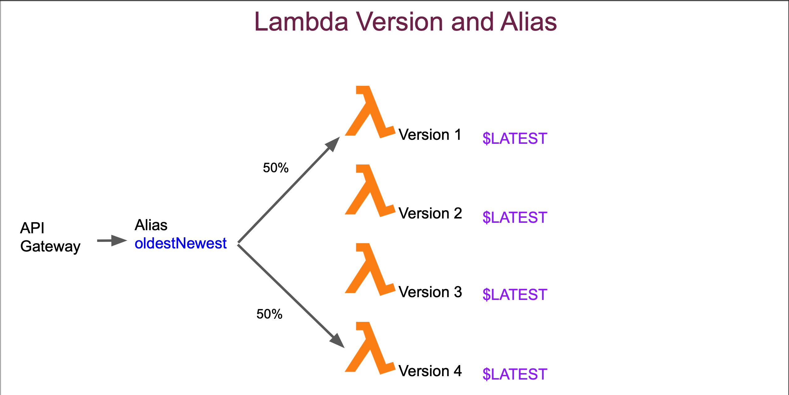

# API Traffic Splitting Using Lambda Alias - Quick Notes

## 🔄 API Traffic Splitting Using Lambda Version and Alias

**Note:** This is how we need to give our lambda function name in API gateway: 
`versionTest:${stageVariables.lambdaAlias}` where:
1) **versionTest** is the name of lambda function
2) However instead of pointing directly to an alias, we are getting the name of the alias from a stage variable named **lambdaAlias**
3) We are not assigning direct alias values here because for different stages (dev,prod) we can have different aliases or different stageVariables

## 🏗️ Setup Components

**Lambda Function:** `versionTest`
**Stage Variables:** Different per stage
**Alias Configuration:** Per environment

**Stage Variable Configuration:**
```
DEV Stage:
  stageVariables.lambdaAlias = "DEV"

PROD Stage:
  stageVariables.lambdaAlias = "PROD"
```

## 💡 Integration Format

**API Gateway Lambda Integration:**
```
Function Name: versionTest:${stageVariables.lambdaAlias}
```

**Resolves to:**
```
DEV Stage: versionTest:DEV
PROD Stage: versionTest:PROD
```

## 🎯 Benefits of Stage Variables

**Flexibility:**
- Same API configuration across stages
- Different aliases per environment
- Easy environment management

**Example Flow:**
```
DEV API → versionTest:DEV → Version 1 (100%)
PROD API → versionTest:PROD → Version 1 (50%) + Version 2 (50%)
```

## ❓ Quick Interview Q&A

**Q: How to reference Lambda alias in API Gateway?**  
A: `functionName:${stageVariables.aliasName}`

**Q: Why use stage variables instead of direct alias?**  
A: Different stages can have different aliases (dev vs prod environments)

**Q: What does `versionTest:${stageVariables.lambdaAlias}` resolve to?**  
A: Function name + alias from stage variable (e.g., versionTest:PROD)

**Q: Benefit of stage variables for Lambda integration?**  
A: Same API config works across stages with different aliases

**Q: How do different stages use different aliases?**  
A: Each stage has its own stageVariables.lambdaAlias value

## 🎯 Key Takeaways

✅ **Format** = `functionName:${stageVariables.aliasName}`  
✅ **Stage Variables** = Different alias per environment  
✅ **Flexibility** = Same API config, different backends  
✅ **Environment Separation** = DEV vs PROD aliases  
✅ **Traffic Control** = Alias handles version splitting

---
💡 **Interview Tip:** "Stage variables enable same API Gateway config to use different Lambda aliases per environment"

## 📸 Screenshot

 