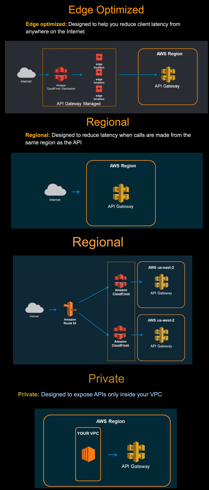

# API Endpoint Types - Quick Notes

## 🌍 API Gateway Endpoint Types

**Three Types of API Gateway Endpoints:**
1. **Edge-Optimized** (Default)
2. **Regional** 
3. **Private**

## 🚀 Edge-Optimized Endpoint

**What:** Uses CloudFront edge locations for global distribution

**Features:**
- Default endpoint type
- Global CDN caching
- Reduced latency worldwide
- CloudFront integration

**Best For:**
- Global applications
- Users distributed worldwide
- Need for lowest latency globally

**URL Format:**
```
https://{api-id}.execute-api.{region}.amazonaws.com
```

## 🏢 Regional Endpoint

**What:** Deployed in specific AWS region without CloudFront

**Features:**
- Single region deployment
- Direct connection to API Gateway
- Lower latency within region
- No CloudFront overhead

**Best For:**
- Regional applications
- Users primarily in one region
- Need for regional compliance
- Custom CDN solutions

**URL Format:**
```
https://{api-id}.execute-api.{region}.amazonaws.com
```

## 📋 Regional Endpoint Architecture (From Diagram)

**Traffic Flow:**
```
Internet → Route 53 → CloudFront (optional) → Regional API Gateway
```

**Key Points from Diagram:**
- **Route 53** - DNS routing to nearest region
- **CloudFront** - Optional, can still be used for caching
- **Multiple Regions** - Deploy API Gateway in us-east-2, us-west-2, etc.
- **Regional Isolation** - Each region has its own API Gateway instance

**Benefits of Multi-Region Setup:**
- **Disaster Recovery** - Failover between regions
- **Reduced Latency** - Users hit nearest region
- **Regional Compliance** - Data stays in specific regions
- **Load Distribution** - Traffic spread across regions

**DNS Routing Options:**
- **Latency-based** - Route to lowest latency region
- **Geolocation** - Route based on user location
- **Weighted** - Split traffic by percentage
- **Health checks** - Failover to healthy regions

## 🔒 Private Endpoint

**What:** Accessible only from within VPC using VPC endpoints

**Features:**
- VPC-only access
- Enhanced security
- No internet gateway required
- Interface VPC endpoint needed

**Best For:**
- Internal applications
- High security requirements
- VPC-to-VPC communication
- Compliance requirements

**Access Method:**
- VPC Endpoint required
- Resource policy for access control
- No public internet access

## 📊 Comparison Table

| Feature | Edge-Optimized | Regional | Private |
|---------|---------------|----------|---------|
| **CloudFront** | ✅ Yes | ❌ No | ❌ No |
| **Global Reach** | ✅ Best | ⚠️ Limited | ❌ VPC Only |
| **Latency** | ✅ Global Low | ✅ Regional Low | ✅ VPC Low |
| **Security** | ⚠️ Public | ⚠️ Public | ✅ Private |
| **Cost** | 💰 Higher | 💰 Medium | 💰 Lower |

## 🔧 Configuration Examples

**Edge-Optimized:**
```json
{
  "endpointConfiguration": {
    "types": ["EDGE"]
  }
}
```

**Regional:**
```json
{
  "endpointConfiguration": {
    "types": ["REGIONAL"]
  }
}
```

**Private:**
```json
{
  "endpointConfiguration": {
    "types": ["PRIVATE"],
    "vpcEndpointIds": ["vpce-12345678"]
  }
}
```

## ❓ Quick Interview Q&A

**Q: What are the 3 API Gateway endpoint types?**  
A: Edge-Optimized, Regional, and Private

**Q: What is Edge-Optimized endpoint?**  
A: Uses CloudFront edge locations for global distribution and reduced latency

**Q: When to use Regional endpoint?**  
A: When users are primarily in one region or need regional compliance

**Q: What is Private endpoint?**  
A: VPC-only accessible endpoint for internal applications with high security

**Q: Difference between Edge-Optimized and Regional?**  
A: Edge uses CloudFront for global reach, Regional is single region without CDN

**Q: How does multi-region Regional setup work?**  
A: Deploy API Gateway in multiple regions, use Route 53 for DNS routing to nearest region

**Q: Can you use CloudFront with Regional endpoints?**  
A: Yes, you can optionally add CloudFront for additional caching and global distribution

**Q: What DNS routing options work with Regional endpoints?**  
A: Latency-based, geolocation, weighted routing, and health checks for failover

## 🎯 Key Takeaways

✅ **Edge-Optimized** = Global reach with CloudFront CDN  
✅ **Regional** = Single region, no CloudFront overhead  
✅ **Private** = VPC-only access for maximum security  
✅ **Default** = Edge-Optimized is the default choice  
✅ **Use Case** = Choose based on user distribution and security needs

---
💡 **Interview Tip:** "Choose endpoint type based on user geography and security requirements"

## 📸 Screenshot

