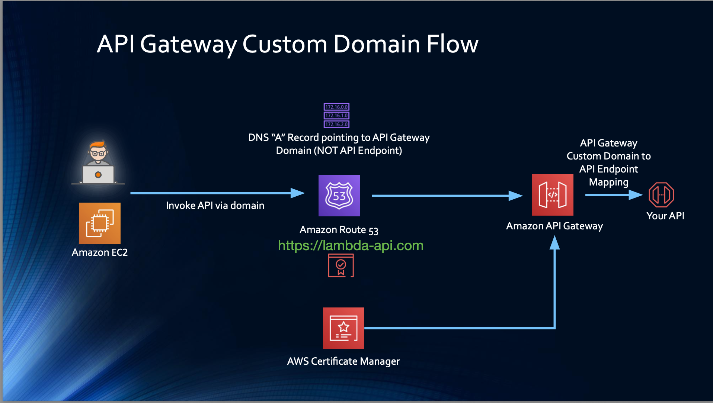

# API Gateway Custom Domain - What and Why - Quick Notes

## 🌐 1) Invoke via API Gateway URL

**Default Invoke URL:**
```
https://abc123.execute-api.us-east-1.amazonaws.com/prod/users
```

**Note:** APIs are not only invoked by users using invoke URL but also by systems like EC2. They take this invoke URL and encode it as parameter in the app. Suppose if you change the API and version, invoke URL will change, all systems will have to change this URL and then test it.

**Problems with Default URL:**
- Hard to remember
- Changes when API is recreated
- Not user-friendly
- Systems need updates when URL changes
- No branding

## 🏷️ 2) Invoke API via Custom Domain

**Custom Domain Example:**
```
https://lambda-api.com/users
```

**Benefits:**
- Easy to remember
- Branded URL
- URL remains same even if API changes
- Professional appearance
- No system updates needed

## ⚠️ 3) Things to Keep in Mind with Custom Domain

**Prerequisites:**
- SSL certificate (AWS Certificate Manager)
- Domain ownership verification
- Route 53 hosted zone (recommended)
- API Gateway configuration

**Important Considerations:**
- Certificate must be in same region as API Gateway (Regional)
- Certificate must be in us-east-1 for Edge-Optimized
- Domain validation required
- DNS propagation time (up to 48 hours)
- HTTPS only (no HTTP support)

## 🔄 4) API Gateway Custom Domain Flow

**High-Level Flow:**
```
Custom Domain → Route 53 → API Gateway → Lambda
```

**Detailed Steps:**
1. **Register Domain** - Route 53 or external registrar
2. **Create SSL Certificate** - AWS Certificate Manager
3. **Create Custom Domain** - API Gateway console
4. **Map Base Path** - Connect domain to API stage
5. **Update DNS** - Point domain to API Gateway

## 🌍 5) What is Route 53

**Route 53:** AWS managed DNS service for domain registration and routing

**Key Features:**
- Domain registration
- DNS hosting
- Health checks
- Traffic routing policies
- Integration with AWS services

**Why Use Route 53:**
- Seamless AWS integration
- High availability
- Global DNS resolution
- Easy custom domain setup

## 📊 6) API Gateway Custom Domain Flow (From Screenshot)

**Complete Flow Architecture:**

**Step 1: Domain Registration**
```
Register domain: lambda-api.com in Route 53
```

**Step 2: SSL Certificate**
```
AWS Certificate Manager → Create certificate for lambda-api.com
```

**Step 3: Custom Domain Setup**
```
API Gateway → Custom Domain Names → Create
- Domain: lambda-api.com
- Certificate: Select from ACM
- Endpoint: Regional/Edge-Optimized
```

**Step 4: Base Path Mapping**
```
Custom Domain → Base Path Mappings
- Path: (empty) or /api
- Destination: API-ID, Stage (prod)
```

**Step 5: DNS Configuration**
```
Route 53 → Hosted Zone → Create Record
- Type: A (Alias)
- Name: lambda-api.com
- Target: API Gateway domain name
```

**Request Flow:**
```
User Request: https://lambda-api.com/users
       ↓
Route 53: Resolves to API Gateway
       ↓
API Gateway: Custom Domain → Base Path → Stage
       ↓
Lambda: Processes request
       ↓
Response: Returns via same path
```

**Components Involved:**
- **Route 53** - DNS resolution
- **ACM** - SSL certificate management
- **API Gateway** - Custom domain configuration
- **Lambda** - Backend processing

## 💡 Practical Example

**Before Custom Domain:**
```
EC2 App Config:
API_URL = "https://abc123.execute-api.us-east-1.amazonaws.com/prod"

// If API changes, update everywhere
```

**After Custom Domain:**
```
EC2 App Config:
API_URL = "https://lambda-api.com"

// URL never changes, no updates needed
```

## 🛠️ Full Hands-On Example - API Gateway Custom Domain Setup

### **Step 1: Domain Registration (Route 53)**
```
1. Go to Route 53 Console
2. Click "Register Domain"
3. Search for: "lambda-api.com"
4. Complete registration ($12-15/year)
5. Wait for registration confirmation (up to 3 days)
```

### **Step 2: Create SSL Certificate (ACM)**
```
1. Go to AWS Certificate Manager
2. Click "Request Certificate"
3. Choose "Request a public certificate"
4. Domain name: "lambda-api.com"
5. Add "*.lambda-api.com" for subdomains
6. Validation method: DNS validation
7. Click "Request"
8. Go to Route 53 → Add CNAME records for validation
9. Wait for certificate status: "Issued"
```

### **Step 3: Create API Gateway**
```
1. API Gateway Console → Create API
2. Choose REST API
3. Create resources: /users, /products
4. Deploy to stage: "prod"
5. Note the invoke URL: https://abc123.execute-api.us-east-1.amazonaws.com/prod
```

### **Step 4: Create Custom Domain (API Gateway)**
```
1. API Gateway Console → Custom Domain Names
2. Click "Create Custom Domain Name"
3. Domain name: "lambda-api.com"
4. Endpoint configuration: Regional
5. ACM certificate: Select your certificate
6. Click "Create Domain Name"
7. Note the Target Domain Name: d-xyz123.execute-api.us-east-1.amazonaws.com
```

### **Step 5: Configure Base Path Mapping**
```
1. In Custom Domain → Base Path Mappings tab
2. Click "Configure API mappings"
3. Path: (leave empty for root)
4. API: Select your API
5. Stage: prod
6. Click "Save"
```

### **Step 6: Update DNS (Route 53)**
```
1. Route 53 → Hosted Zones → lambda-api.com
2. Click "Create Record"
3. Record name: (leave empty for root domain)
4. Record type: A
5. Alias: Yes
6. Route traffic to: "Alias to API Gateway API"
7. Region: us-east-1
8. API Gateway domain: Select your custom domain
9. Click "Create Records"
```

### **Step 7: Test Setup**
```
1. Wait for DNS propagation (5-30 minutes)
2. Test in browser: https://lambda-api.com/users
3. Should return same response as original invoke URL
4. Check SSL certificate in browser (should be valid)
```


### **Permissions Required:**
```
IAM Permissions:
- route53:*
- acm:*
- apigateway:*
- iam:CreateServiceLinkedRole
```
```

## 🚨 Common Issues & Solutions

### **Certificate Issues:**
```
Problem: Certificate not appearing in API Gateway
Solution: Ensure certificate is in correct region
- Regional endpoint: Same region as API Gateway
- Edge-optimized: us-east-1 region only
```

### **DNS Issues:**
```
Problem: Custom domain not resolving
Solution: Check DNS propagation
- Use: dig lambda-api.com
- Verify A record points to API Gateway domain
```

### **SSL Issues:**
```
Problem: SSL certificate validation stuck
Solution: Ensure CNAME records added correctly in Route 53
- Check ACM console for required CNAME values
- Add exact CNAME records in hosted zone
```

## � Complete Request Flow with Custom Domain

### **Detailed Step-by-Step Flow:**

**1. DNS Resolution:**
```
User requests: https://lambda-api.com/users
Route 53 resolves: lambda-api.com → d-xyz123.execute-api.us-east-1.amazonaws.com
```

**2. SSL Handshake:**
```
Browser connects to API Gateway domain
ACM certificate validates lambda-api.com
Secure connection established
```

**3. API Gateway Processing:**
```
Request hits custom domain endpoint
Base path mapping routes: / → prod stage
API Gateway finds resource: /users
Method: GET is invoked
```

**4. Lambda Execution:**
```
API Gateway triggers Lambda function
Lambda processes the request
Returns response to API Gateway
```

**5. Response Delivery:**
```
API Gateway processes response
Returns through custom domain
User receives response from lambda-api.com
```

## 🎯 Real-World Scenario

### **E-commerce API Setup:**

**Domain:** `api.mystore.com`

**API Structure:**
```
https://api.mystore.com/
├── /products
├── /orders
├── /users
├── /payments
└── /inventory
```

**Configuration:**
```
1. Domain: api.mystore.com
2. Certificate: *.mystore.com (wildcard)
3. API Gateway: Regional endpoint
4. Base Path: / → prod stage
5. Route 53: A record → API Gateway domain
```
## ❓ Quick Interview Q&A

**Q: Why use custom domain for API Gateway?**  
A: User-friendly URLs, branding, URL stability when APIs change, no system updates needed

**Q: What is required for custom domain setup?**  
A: SSL certificate, domain ownership, Route 53 hosted zone, API Gateway configuration

**Q: Where should SSL certificate be created?**  
A: Same region as API Gateway (Regional) or us-east-1 (Edge-Optimized)

**Q: What is Route 53?**  
A: AWS managed DNS service for domain registration and routing

**Q: What happens when you recreate API with custom domain?**  
A: Custom domain URL stays same, just update base path mapping

**Q: How does custom domain request flow work?**  
A: User → Route 53 → API Gateway Custom Domain → Base Path → Stage → Lambda

## 🎯 Key Takeaways

✅ **Problem** = Default URLs change when APIs are recreated  
✅ **Solution** = Custom domains provide stable, branded URLs  
✅ **Requirements** = SSL certificate + Route 53 + API Gateway setup  
✅ **Flow** = Domain → Route 53 → API Gateway → Lambda  
✅ **Benefit** = No system updates needed when API changes  
✅ **Route 53** = AWS DNS service for domain management

---
💡 **Interview Tip:** "Custom domains solve URL stability issues and provide branding for API endpoints"

## Screenshot:

