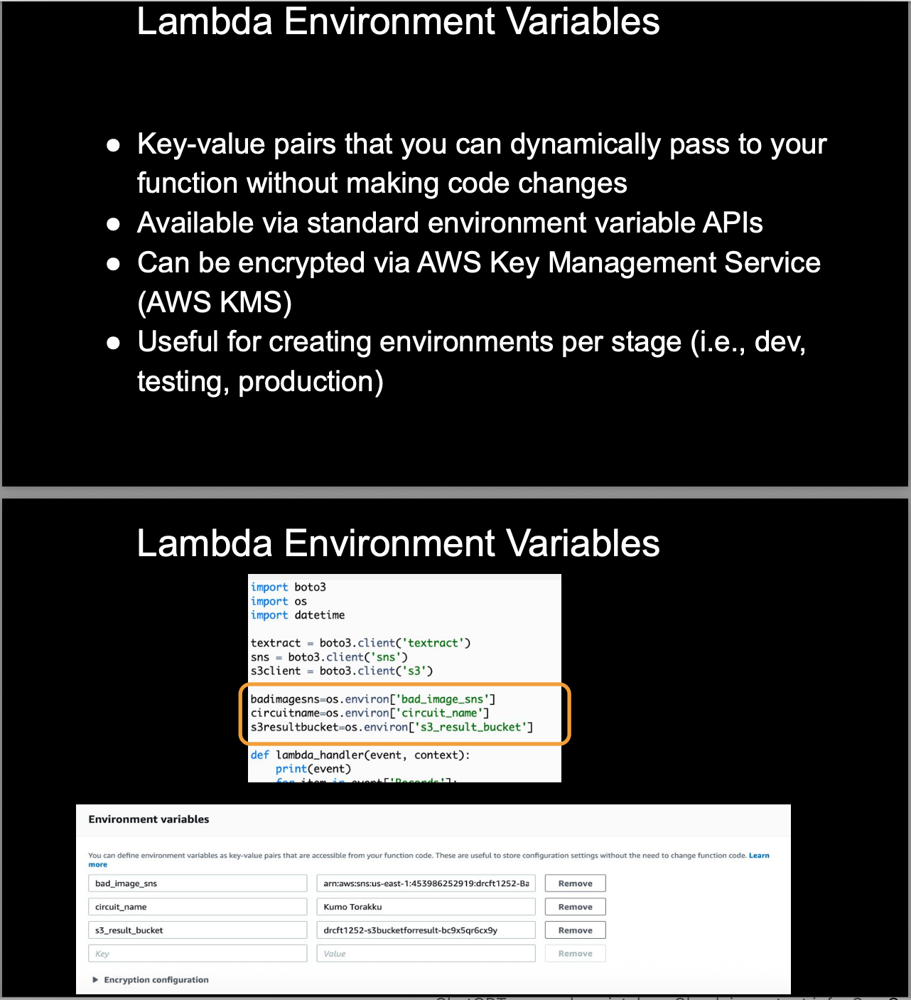

# Lambda Environment Variables - Quick Notes

## 🌍 What are Lambda Environment Variables?

### **Definition:**
Environment variables are key-value pairs that you can set for Lambda functions to pass configuration data without hardcoding values in your code.

### **Purpose:**
- **Configuration Management:** Store settings outside code
- **Security:** Keep sensitive data separate from source code
- **Environment-Specific Values:** Different configs for dev/test/prod
- **Runtime Flexibility:** Change behavior without code changes

### **How They Work:**
```
Lambda Function Code:
import os
database_url = os.environ['DATABASE_URL']
api_key = os.environ['API_KEY']
environment = os.environ['ENVIRONMENT']
```

## 🔧 Environment Variables - Key Features

### **Built-in Lambda Environment Variables:**
AWS automatically provides these environment variables:
```
AWS_REGION = "us-east-1"
AWS_LAMBDA_FUNCTION_NAME = "my-function"
AWS_LAMBDA_FUNCTION_VERSION = "1"
AWS_LAMBDA_RUNTIME_API = "127.0.0.1:9001"
AWS_LAMBDA_LOG_GROUP_NAME = "/aws/lambda/my-function"
AWS_LAMBDA_LOG_STREAM_NAME = "2023/09/04/[$LATEST]..."
_LAMBDA_RUNTIME_DIR = "/var/runtime"
LAMBDA_TASK_ROOT = "/var/task"
```

### **Custom Environment Variables:**
You define these based on your application needs:
```
DATABASE_URL = "https://db.example.com"
API_KEY = "your-secret-api-key"
ENVIRONMENT = "production"
DEBUG_MODE = "false"
MAX_CONNECTIONS = "100"
```

### **Environment Variable Limits:**
- **Total Size:** 4 KB for all environment variables combined
- **Individual Variable:** No specific limit (within total 4 KB)
- **Number of Variables:** No specific limit (within total 4 KB)
- **Encryption:** Automatic encryption at rest

## 🏗️ Hands-On Example - Multi-Environment Setup

### **Scenario: E-commerce API with Dev/Test/Prod Environments**

### **Function Code (Python):**
```python
import json
import os
import boto3

def lambda_handler(event, context):
    # Get environment variables
    environment = os.environ.get('ENVIRONMENT', 'development')
    database_url = os.environ.get('DATABASE_URL')
    api_key = os.environ.get('THIRD_PARTY_API_KEY')
    debug_mode = os.environ.get('DEBUG_MODE', 'false').lower() == 'true'
    max_connections = int(os.environ.get('MAX_CONNECTIONS', '10'))
    
    # Environment-specific logic
    if debug_mode:
        print(f"Running in {environment} environment")
        print(f"Database URL: {database_url}")
        print(f"Max connections: {max_connections}")
    
    # Database connection
    if environment == 'production':
        # Use production database with high connection pool
        db_config = {
            'url': database_url,
            'pool_size': max_connections,
            'ssl': True
        }
    elif environment == 'testing':
        # Use test database with moderate settings
        db_config = {
            'url': database_url,
            'pool_size': 5,
            'ssl': False
        }
    else:  # development
        # Use development database with basic settings
        db_config = {
            'url': database_url,
            'pool_size': 2,
            'ssl': False
        }
    
    # API response based on environment
    response = {
        'statusCode': 200,
        'body': json.dumps({
            'message': f'Hello from {environment} environment!',
            'environment': environment,
            'debug': debug_mode,
            'database_configured': bool(database_url)
        })
    }
    
    return response
```

### **Development Environment Configuration:**
```
Environment Variables for DEV:
┌─────────────────────┬─────────────────────────────────────┐
│ Key                 │ Value                               │
├─────────────────────┼─────────────────────────────────────┤
│ ENVIRONMENT         │ development                         │
│ DATABASE_URL        │ postgresql://dev.db.example.com     │
│ THIRD_PARTY_API_KEY │ dev-api-key-12345                   │
│ DEBUG_MODE          │ true                                │
│ MAX_CONNECTIONS     │ 5                                   │
│ LOG_LEVEL           │ DEBUG                               │
└─────────────────────┴─────────────────────────────────────┘
```

### **Testing Environment Configuration:**
```
Environment Variables for TEST:
┌─────────────────────┬─────────────────────────────────────┐
│ Key                 │ Value                               │
├─────────────────────┼─────────────────────────────────────┤
│ ENVIRONMENT         │ testing                             │
│ DATABASE_URL        │ postgresql://test.db.example.com    │
│ THIRD_PARTY_API_KEY │ test-api-key-67890                  │
│ DEBUG_MODE          │ true                                │
│ MAX_CONNECTIONS     │ 10                                  │
│ LOG_LEVEL           │ INFO                                │
└─────────────────────┴─────────────────────────────────────┘
```

### **Production Environment Configuration:**
```
Environment Variables for PROD:
┌─────────────────────┬─────────────────────────────────────┐
│ Key                 │ Value                               │
├─────────────────────┼─────────────────────────────────────┤
│ ENVIRONMENT         │ production                          │
│ DATABASE_URL        │ postgresql://prod.db.example.com    │
│ THIRD_PARTY_API_KEY │ prod-api-key-abcdef                 │
│ DEBUG_MODE          │ false                               │
│ MAX_CONNECTIONS     │ 50                                  │
│ LOG_LEVEL           │ WARN                                │
└─────────────────────┴─────────────────────────────────────┘
```

## 🔐 Security Best Practices

### **Encryption:**
```
Environment Variables Security:
✅ Automatic encryption at rest
✅ Encrypted in transit
✅ Use AWS KMS for additional encryption
✅ Avoid storing secrets in plain text
```

### **Sensitive Data Handling:**
```
❌ Don't Store in Environment Variables:
- Database passwords
- Private keys
- Long-term secrets

✅ Use Instead:
- AWS Secrets Manager
- AWS Systems Manager Parameter Store
- AWS KMS for encryption keys
```

### **Secure Example:**
```python
import boto3
import os

def get_secret(secret_name):
    session = boto3.session.Session()
    client = session.client('secretsmanager', region_name=os.environ['AWS_REGION'])
    response = client.get_secret_value(SecretId=secret_name)
    return response['SecretString']

def lambda_handler(event, context):
    # Environment variable points to secret name
    secret_name = os.environ['DB_SECRET_NAME']
    
    # Retrieve actual secret from Secrets Manager
    db_credentials = get_secret(secret_name)
    
    # Use credentials for database connection
    # ... rest of function logic
```

## 🛠️ AWS CLI Configuration Examples

### **Setting Environment Variables via CLI:**

**Development Function:**
```bash
aws lambda update-function-configuration \
  --function-name ecommerce-api-dev \
  --environment Variables='{
    "ENVIRONMENT": "development",
    "DATABASE_URL": "postgresql://dev.db.example.com",
    "THIRD_PARTY_API_KEY": "dev-api-key-12345",
    "DEBUG_MODE": "true",
    "MAX_CONNECTIONS": "5",
    "LOG_LEVEL": "DEBUG"
  }'
```

## 📊 Environment Variables vs Other Configuration Methods

| Method | Pros | Cons | Use Case |
|--------|------|------|----------|
| **Environment Variables** | Simple, fast access | 4KB limit, visible in console | Non-sensitive config |
| **Parameter Store** | Hierarchical, versioning | API calls needed | App configuration |
| **Secrets Manager** | Automatic rotation | Higher cost | Sensitive secrets |
| **Config Files** | Large size, structured | Deployment complexity | Complex configs |

## 🔄 Dynamic Configuration Pattern

### **Runtime Configuration Updates:**
```python
import boto3
import os
import json

def get_dynamic_config():
    """Get configuration from Parameter Store"""
    ssm = boto3.client('ssm')
    
    environment = os.environ['ENVIRONMENT']
    config_path = f"/app/config/{environment}"
    
    try:
        response = ssm.get_parameters_by_path(
            Path=config_path,
            Recursive=True,
            WithDecryption=True
        )
        
        config = {}
        for param in response['Parameters']:
            key = param['Name'].split('/')[-1]
            config[key] = param['Value']
        
        return config
    except Exception as e:
        # Fallback to environment variables
        return {
            'database_url': os.environ.get('DATABASE_URL'),
            'api_key': os.environ.get('THIRD_PARTY_API_KEY')
        }

def lambda_handler(event, context):
    # Static environment variables
    environment = os.environ.get('ENVIRONMENT', 'development')
    debug_mode = os.environ.get('DEBUG_MODE', 'false').lower() == 'true'
    
    # Dynamic configuration
    config = get_dynamic_config()
    
    return {
        'statusCode': 200,
        'body': json.dumps({
            'environment': environment,
            'debug': debug_mode,
            'config_loaded': len(config) > 0
        })
    }
```


## ❓ Quick Interview Q&A

**Q: What are Lambda environment variables?**  
A: Key-value pairs for configuration data, accessible via `os.environ`, with 4KB total limit and automatic encryption

**Q: How do you handle different environments (dev/test/prod)?**  
A: Set different environment variable values for each function deployment, keeping same code but different configs

**Q: Should you store secrets in environment variables?**  
A: No, use AWS Secrets Manager or Parameter Store for sensitive data, environment variables are visible in console

**Q: What's the size limit for environment variables?**  
A: 4 KB total for all environment variables combined per Lambda function

**Q: How to access environment variables in code?**  
A: Use `os.environ['VARIABLE_NAME']` or `os.environ.get('VARIABLE_NAME', 'default_value')`

## 🎯 Key Takeaways

✅ **Configuration Management** = Store settings outside code for flexibility  
✅ **Environment-Specific** = Different values for dev/test/prod deployments  
✅ **4KB Limit** = Total size limit for all environment variables  
✅ **Security** = Use Secrets Manager for sensitive data, not env vars  
✅ **Built-in Variables** = AWS provides system environment variables automatically  
✅ **Runtime Access** = Use `os.environ` to read values in function code  

---
💡 **Interview Tip:** "Environment variables provide configuration flexibility but use Secrets Manager for sensitive data"

## 📸 Screenshots


*Lambda Console showing environment variables configuration for different environments*