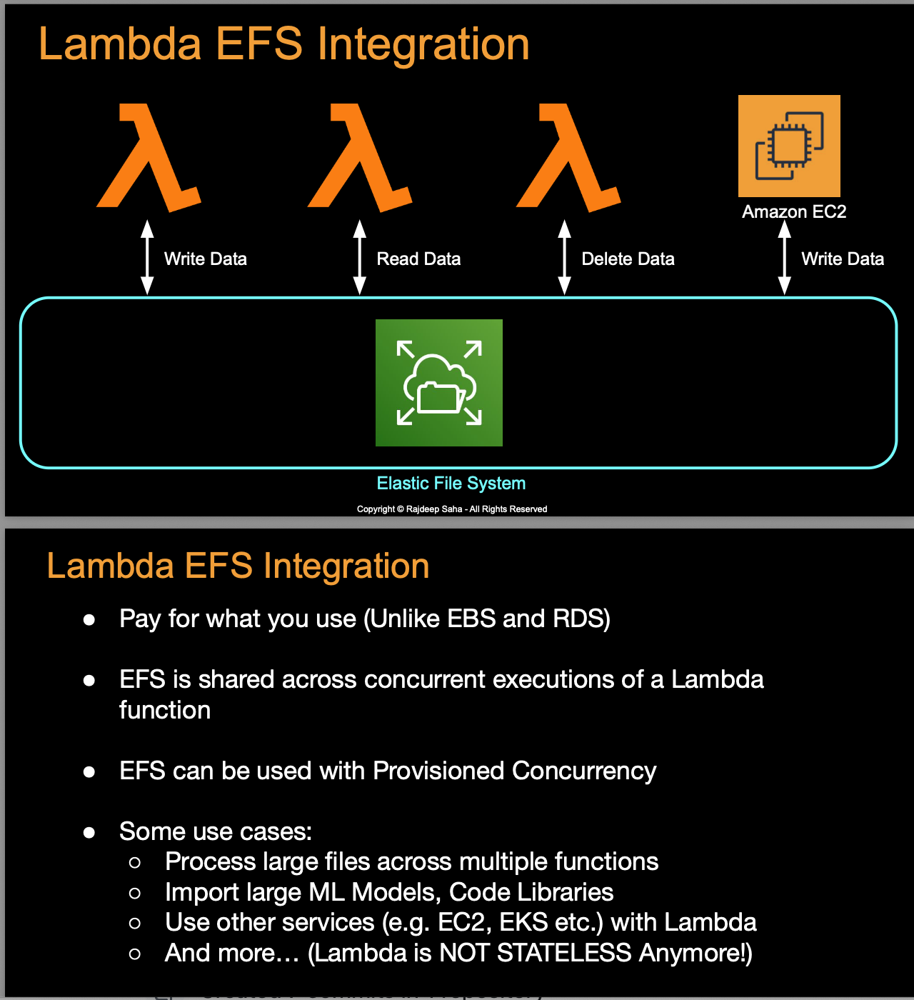

# EFS Integration with Lambda - Quick Notes

## 📁 What is EFS?
### **Definition:**
Amazon EFS is a fully managed, elastic, shared file system for AWS compute services

**Amazon EFS (Elastic File System):**
- Fully managed, shared file system for AWS services
- POSIX-compliant with standard file operations
- Automatically scales (petabyte scale)
- Accessible by multiple services simultaneously

### **EFS vs Other Storage:**
```
EFS (Elastic File System):
✅ Shared across multiple instances
✅ Automatically scales (petabyte scale)
✅ POSIX-compliant file system
✅ Concurrent access from multiple services

EBS (Elastic Block Store):
❌ Attached to single instance only
❌ Fixed size (manual scaling)
✅ High IOPS performance
❌ Block-level storage

S3 (Simple Storage Service):
❌ Object storage (not file system)
✅ Unlimited capacity
❌ No POSIX compliance
✅ Internet accessible
```

## 💾 Lambda Temporary File System Issues

**Lambda /tmp Directory:**
- **Size:** 512 MB - 10 GB (configurable)
- **Ephemeral:** Data lost when execution environment is recycled
- **Single Access:** Cannot share between function instances
- **Problem:** No persistence, no sharing, size limitations

### **Problems with Ephemeral Storage:**
- **Data Loss:** Files disappear when Lambda scales down
- **No Sharing:** Cannot share data between concurrent executions
- **Size Limitations:** Maximum 10 GB storage space
- **Cold Start Impact:** Need to recreate/download data on each cold start
- **No Persistence:** Cannot maintain state between invocations

## 🔗 What is Lambda EFS Integration?

### **Definition:**
Lambda EFS Integration allows Lambda functions to mount and access Amazon EFS file systems directly

### **How It Works:**
```
Lambda Function → VPC → EFS Mount Target → EFS File System
```

### **Integration Architecture:**
- **VPC Requirement:** Lambda must be deployed in VPC to access EFS
- **Mount Targets:** EFS creates mount targets in VPC subnets
- **File System Access:** Lambda mounts EFS as a local file system
- **Persistent Storage:** Data persists beyond function lifecycle

### **Access Pattern:**
```
Traditional Lambda:
Function Code → /tmp (ephemeral) → Data lost

Lambda with EFS:
Function Code → /mnt/efs (persistent) → Data persists
```

## ⚡ Key Features

1. **Persistent Storage** - Files survive between invocations
2. **Concurrent Access** - Multiple functions share same data
3. **No Size Limits** - Scales automatically to petabytes
4. **VPC Security** - Secure access within VPC
5. **Cost Efficient** - Pay only for storage used
6. **Multi-Service** - Shared with EC2, ECS, EKS, Batch
7. **POSIX Compliance-Standard Operations:** Standard file system operations (read, write, chmod, etc.)

## 🔄 EFS with Other AWS Services

### **EFS Multi-Service Integration:**
EFS can be simultaneously used with multiple AWS services, providing shared storage layer

**Services Using Same EFS:**
### **Services That Can Use EFS:**

**1. Amazon EC2:**
- **Shared File System:** Multiple EC2 instances access same EFS

**2. AWS Lambda:**
- **Persistent Functions:** Lambda functions with persistent storage
- **Shared Libraries:** Common libraries accessible across functions
- **Data Processing:** Process large datasets stored in EFS

**3. Amazon ECS (Elastic Container Service):**
- **Container Storage:** Persistent storage for containerized applications

**4. Amazon EKS (Elastic Kubernetes Service):**
- **Persistent Volumes:** Kubernetes persistent volume claims
- **Shared Storage:** Pod-to-pod data sharing
- **Stateful Applications:** Database storage for stateful workloads

**5. AWS Batch:**
- **Job Data:** Shared data between batch jobs
- **Input/Output:** Common location for job inputs and outputs
- **Checkpoint Data:** Save job progress and state

**Benefits:** Unified data layer across all compute services

## 📊 Quick Comparison

## 📊 EFS vs Lambda /tmp Comparison

| Feature | Lambda /tmp | Lambda EFS |
|---------|-------------|------------|
| **Size** | 512 MB - 10 GB | Petabyte scale |
| **Persistence** | Ephemeral | Persistent |
| **Sharing** | Single function | Multiple functions |
| **Performance** | Fast (local) | Network-dependent |
| **Cost** | Included | Pay per GB |
| **Setup** | Automatic | VPC configuration required |
| **Use Case** | Temporary processing | Shared persistent data |

## 🔧 Requirements

**For Lambda EFS Integration:**
- Lambda must be in VPC
- EFS mount targets in same VPC
- Security groups allow NFS (port 2049)
- IAM permissions for EFS access

## ❓ Quick Interview Q&A

**Q: What is Amazon EFS?**  
A: Fully managed, elastic, shared POSIX-compliant file system that scales automatically and can be accessed by multiple AWS services

**Q: What are Lambda temporary file system limitations?**  
A: /tmp directory with 512MB-10GB limit, ephemeral storage that's lost when execution environment is recycled

**Q: What is Lambda EFS integration?**  
A: Feature allowing Lambda functions to mount EFS file systems for persistent, shared storage beyond /tmp limitations

**Q: Key features of Lambda EFS integration?**  
A: Persistent storage, petabyte scale, concurrent access, POSIX compliance, VPC security, shared across multiple services

**Q: Can EFS be used with services other than Lambda?**  
A: Yes - EC2, ECS, EKS, Batch, and other compute services can simultaneously access the same EFS file system

**Q: What's required to use EFS with Lambda?**  
A: Lambda must be in VPC, EFS mount targets in same VPC, proper security groups, and IAM permissions

## 🎯 Key Takeaways

✅ **EFS** = Fully managed, elastic, shared POSIX file system  
✅ **Lambda /tmp** = 512MB-10GB ephemeral storage, lost on container recycling  
✅ **EFS Integration** = Persistent, petabyte-scale storage for Lambda functions  
✅ **Multi-Service** = EFS shared between Lambda, EC2, ECS, EKS, Batch  
✅ **VPC Required** = Lambda must be in VPC to access EFS mount targets  
✅ **POSIX Compliant** = Standard file system operations and permissions  

---
💡 **Interview Tip:** "EFS provides persistent, shared storage for Lambda, overcoming /tmp directory limitations"

## 📸 Screenshot




